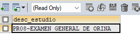

# Manual de uso de la rutina enviaWA
Para usar la rutina basta con mandarla llamar, especificando tres parámetros:
`id_factura`, `ruta` y `id_estudio`.

En donde `id_facura` es el ot de la facura que se imprime en recepción; ese dato también se extrae de la tabla `so_facura`.

La variable `ruta` debe ser en este formato: 

> $ruta = 'https://www.laboratoriosarca.com/sysarcaweb_1.0/pdf_resenv/20032408004_2577.pdf';

La variable  `id_estudio` nos indica el estudio que se realizó el paciente, el cual tiene un **id numérico**; por ejemplo el estudio 2577 es
un Examen General de Orina.

### Análisis detallado

